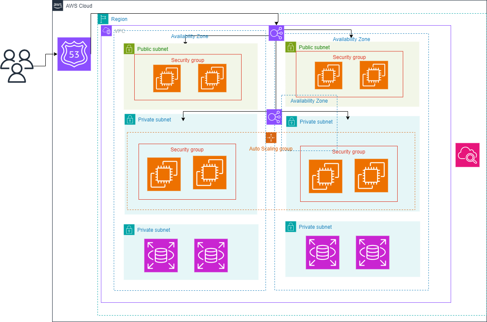

# Arquitetura AWS

Este documento descreve a arquitetura da solução AWS implementada para garantir alta disponibilidade, segurança e escalabilidade.

*A Empresa X, uma grande varejista online, está enfrentando dificuldades com a escalabilidade e a disponibilidade de seu sistema atual de TI. Com o aumento das transações online e a expansão de seus serviços digitais, a empresa decidiu migrar para uma solução de nuvem para melhorar a performance, a segurança e a flexibilidade de sua infraestrutura.*

## *Objetivo do Projeto* 

*Migrar a infraestrutura de TI da Empresa X para a nuvem, implementando uma solução escalável e segura que suporte o crescimento futuro e melhore a experiência do cliente. O grupo deve montar um diagrama de como ficaria a estrutura da AWS.*

## Visão Geral

A arquitetura é composta por uma Virtual Private Cloud (VPC) distribuída em múltiplas zonas de disponibilidade, incluindo sub-redes públicas e privadas, grupos de segurança, um grupo de Auto Scaling e outras funcionalidades AWS.

## Componentes da Arquitetura

1. **Route 53**
   - Gerencia o roteamento de tráfego de usuários para a aplicação na nuvem AWS.

2. **VPC (Virtual Private Cloud)**
   - Proporciona um ambiente de rede isolado onde a infraestrutura é implantada.

3. **Zonas de Disponibilidade**
   - A arquitetura é distribuída em múltiplas zonas de disponibilidade para garantir alta disponibilidade e tolerância a falhas.

4. **Sub-redes**
   - **Sub-redes Públicas:** Hospedam instâncias acessíveis pela internet para receber tráfego externo.
   - **Sub-redes Privadas:** Hospedam instâncias não acessíveis diretamente pela internet, geralmente usadas para backend e banco de dados.

5. **Grupos de Segurança**
   - Controlam o tráfego de entrada e saída para as instâncias, garantindo que apenas o tráfego autorizado possa passar.

6. **Instâncias de EC2**
   - Máquinas virtuais que executam as aplicações.
   - Organizadas em grupos de Auto Scaling para ajuste automático de capacidade conforme a demanda.

7. **Auto Scaling Group**
   - Gerencia a escalabilidade das instâncias de EC2, garantindo que o número adequado de instâncias esteja em execução de acordo com a carga.

8. **Banco de Dados**
   - Instalado em sub-redes privadas para segurança, protegido por grupos de segurança.

## Fluxo de Dados

1. O tráfego de usuários é roteado através do Route 53 para as instâncias nas sub-redes públicas.
2. As instâncias nas sub-redes públicas podem se comunicar com as instâncias nas sub-redes privadas conforme necessário.
3. Os grupos de segurança asseguram que apenas o tráfego autorizado pode passar entre as sub-redes e para o banco de dados.

## Segurança

- A segurança é implementada através de grupos de segurança que restringem o tráfego de rede para os componentes da arquitetura.
- As instâncias do banco de dados estão em sub-redes privadas, não acessíveis diretamente da internet.

## Escalabilidade

- O Auto Scaling ajusta automaticamente a quantidade de instâncias de EC2 de acordo com a carga, assegurando desempenho otimizado.

## Melhorias Recomendadas

- **Balanceador de Carga:** Implementar um Elastic Load Balancer para distribuir automaticamente o tráfego de entrada pelas instâncias de EC2.
- **Backup e Recuperação:** Implementar estratégias de backup e recuperação para garantir a integridade dos dados em casos de falhas.

## Conclusão

Esta arquitetura é projetada para fornecer uma solução robusta, segura e escalável na nuvem AWS, aproveitando ao máximo os serviços AWS para garantir alta disponibilidade e desempenho otimizado.
